# Exercise 8: Create a master image for WVD

In this exercise, we are going to walk through the process of creating a master image for your WVD host pools. The basic concept for a master image is to start with a clean base install of Windows and layer on mandatory updates, applications and configurations. There are many ways to create and manage images for WVD. The steps covered in this exercise are going to walk you through a basic build and capture process that includes core applications and recommended configuration options for WVD.

## **Task 1: Create a new Virtual Machine in Azure**

1. On the Azure portal home page, click on **Create a resource** button.

   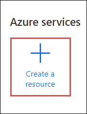

2. In the search bar type *Microsoft Windows 10* and select **Microsoft Windows 10** from suggestions.

   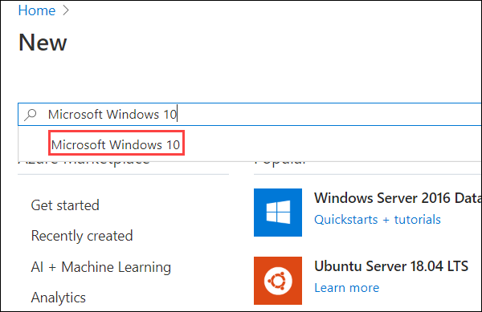

3. On *Microsoft Windows 10* page, select **Windows 10 Enterprise multi-session, Version 1909** from dropdown menu and click on **Create**.

   

4. Provide the below configurations for the virtual machine, and click on **Review + create** and then click on **create**.

   - Subscription: *Choose the default subscription.*
   - Resource Group: *Select WVD-RG from the drop down.*
   - Virtual machine name: **wvdwin10**
   - Region: **EastUS**, *basically this should be same as the region of your resource group.*
   - Image: **Windows 10 Enterprise multi-session, Version 1909-Gen1**
   - Size: **Standard_D2s_v3**
   - Username: **azuser**
   - Password: **Azure1234567**
   - Confirm Password: **Azure1234567**
   - Public inbound ports: select **Allow selected ports**
   - Select inbound ports: **RDP(3389)**
   - **Select** *the checkbox saying "I confirm I have an eligible Windows 10 license with multi-tenant hosting rights."*

    

5. Once the deployment completes, click on **Go to resource**.

   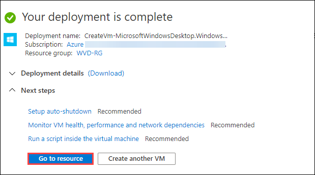

6. Click on **Connect** and select **RDP** from the dropdown.

   

7. Click on **Download RDP file** button.

   

8. Open the downloaded RDP file.

   

9. Now in the RDP client window, click on **Connect** to establish an RDP connection to your virtual machine.

   

10. Enter the credentials of your virtual machine given below, and click on **OK**.

   - Username: **azuser**
   - Password: **Azure1234567**
   
   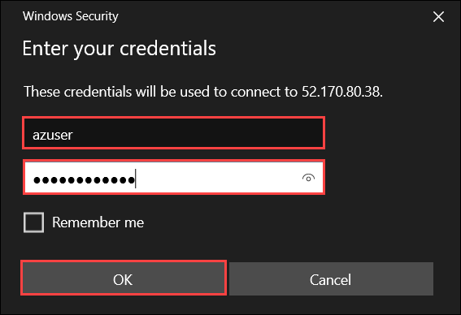

11. The virtual machine will launch and look similar to the screenshot below.

   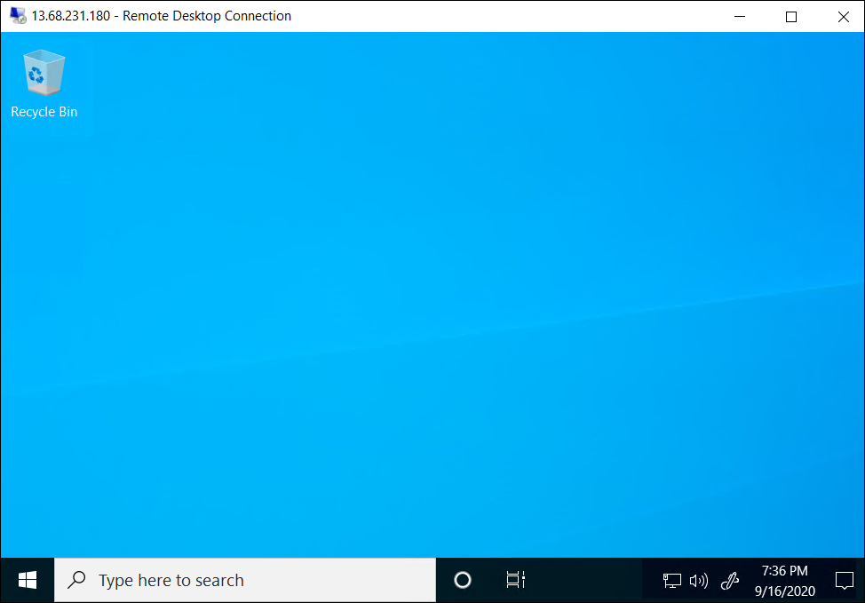

## **Task 2: Run Windows Update**

Despite the Azure support teams best efforts, the Marketplace images are not always up to date. The best and most secure practice is to keep your master image up to date.

1. In the virtual machine, click on **Start** button and open **Settings**.

   

2. Select **Updates & Security** in the *Settings* window.

   

3. Click on **Download** to download and install available windows updates.

   

>**Note:** If the installation of update asks to restart the virtual machine then restart the vm and continue with the next task.

## **Task 3: Prepare WVD image**

**Introduction to the script**

The authors for this content have developed a scripted solution to assist in automating some common baseline image build tasks. The script includes a UI form, enabling you to quickly select which actions to perform. The end result will be a custom master image that incorporates Microsoft's main business applications, along with the necessary policies and settings for an optimized user experience.

The UI form offers the following actions:

**Office 365 ProPlus**

-   Install the **latest** version of Office 365 ProPlus monthly channel.

**OneDrive for Business**

-   Install the **latest** version of OneDrive for Business *per-machine*.

**Microsoft Teams**

-   Install the **latest** version of Microsoft Teams *per-machine*.

**Microsoft Edge Chromium**

-   Install the **latest** version of Microsoft Edge Enterprise.

**FSLogix Profile Containers**

-   Install the **latest** version of the FSLogix Agent.

-   Apply recommended settings.

**OS Settings**

-   Apply the recommended WVD settings for image capture.

**Running the script**

1. Inside your virtual machine click on **Start** and open **Microsoft edge browser**.

   

2. Copy and paste the URL below and click on **Save** to download and save the *Customizations.zip* file.

   `https://minhaskamal.github.io/DownGit/#/home?url=https://github.com/shawntmeyer/WVD/tree/master/Image-Build/Customizations`

   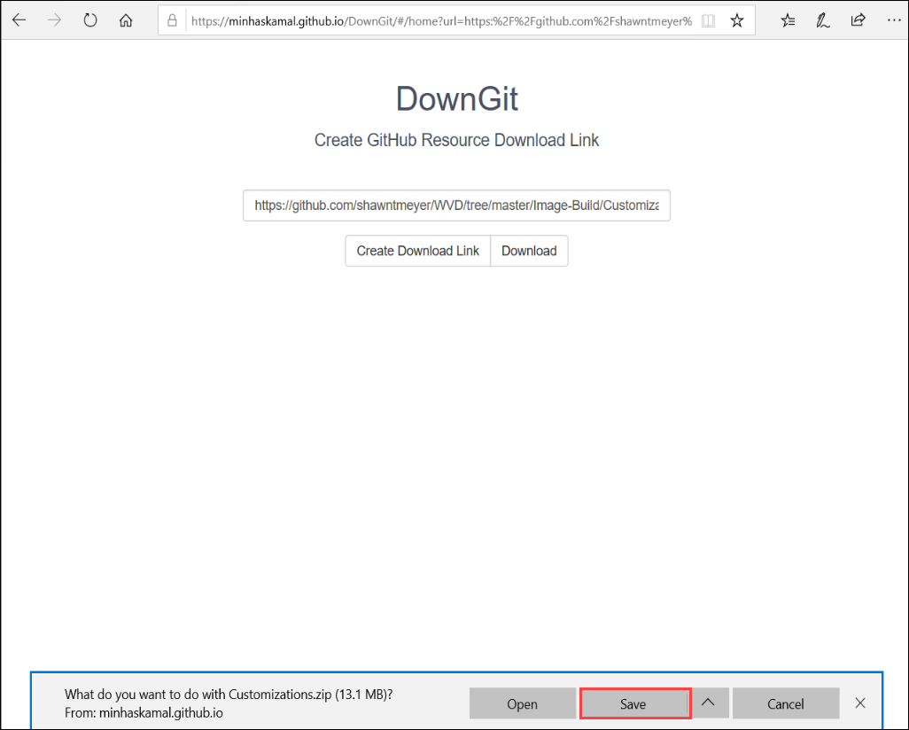

3. Open file explorer and go to *Downloads directory*, then **right click** on *Customizations.zip* and select **Extract All**.

   

4. Click on **Extract** on the window asking to *Select a Destination and Extract Files*.

   

5. Navigate to the taskbar in your virtual machine and search for *PowerShell*, then select **Run as administrator**.

   

6. Use the following command to navigate to "C:\Users\azuser\Documents\Customizations".

   ` cd C:\Users\azuser\Downloads\Customizations\Customizations `

> **Note:** If in case you used a different username for the virtual machine, then in the above command replace ***azuser*** with the username of your Virtual Machine that you created earlier.

7. Run the following command to allow for script execution.

   ` Set-ExecutionPolicy -ExecutionPolicy Bypass -Scope Process -Force `

8. Execute the script by running the following command.

   ` .\Prepare-WVDImage.ps1 -DisplayForm `

9. This will trigger the PowerShell to launch an application, here select the applications shown below and click on **Execute**.

   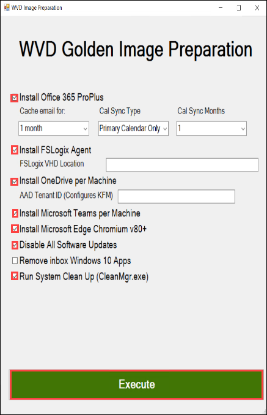

> **Note:** Make sure that the **FSlogix VHD location** and **AAD Tenant ID** columns are left **blank**.

>**Note:** The script will begin configuring the image. **DO NOT close any of the remaining windows that appear until the script has finished execution**. Doing so will interrupt the process and will require you to start over.
>The script will take several minutes to complete depending on the options you selected. Additional input from you is not required during this stage.

> **Note:** This script takes some time to run, so be patient as it may seem like nothing is happening for a while, and then applications will begin to install. You can watch the status from within PowerShell. After the Disk Cleanup Wizard closes, you may notice the PowerShell window does not update. It is waiting for the cleanmgr.exe process to close, which can take some time. You can select the PowerShell window and continue to hit the up arrow on your keyboard until you are presented with an active prompt.

10. Once the script completes, select the **Start** icon and note that **Microsoft Office, Microsoft Edge Chromium,** and **Microsoft Teams** have been installed.

    

11. Now open file explorer and delete **customizations.zip** file and **Customizations** folder from downloads.

    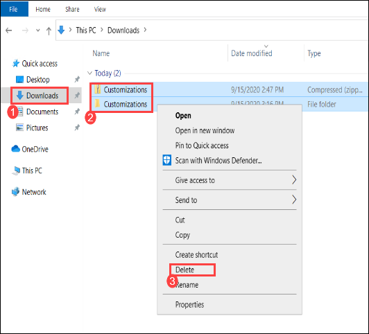

# **Task 4: Run Sysprep**

1. In taskbar search for *command prompt* and select **Run as administrator**.

   

2. Navigate to "C:\Windows\System32\Sysprep" by running the command below.

   ` cd C:\Windows\System32\Sysprep `

3. Run the following command to sysprep the VM and shutdown.

   ` sysprep.exe /oobe /generalize /shutdown `

> **Note:** The system will automatically shut down and disconnect your RDP session.

## **Task 5: Create a managed image from the Master Image VM**

1. In Azure portal search for *virtual machine* and click on it.

   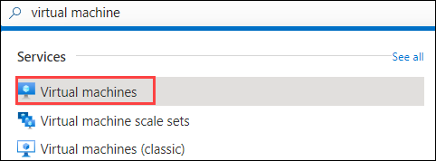

2. On the Virtual machines blade, open the VM we used for creating master image i.e., **wvdwin10**.

   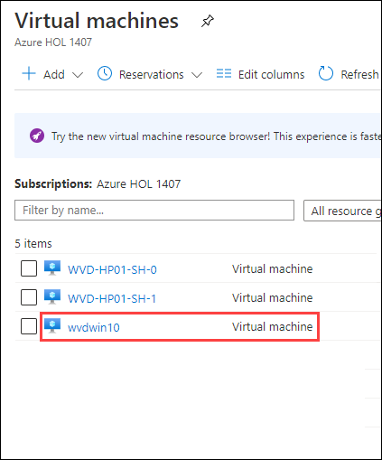

3. On the *Overview* blade for the Virtual machine, confirm the *Status* reflects as **Stopped**. 
   
   

4. Click on the **Stop** button to move it to *deallocated state*.

   

5. Click **OK** to the prompt asking *Stop this virtual machine*.

   

6. Once the virtual machine is in *deallocated* state, click on **Capture**.

   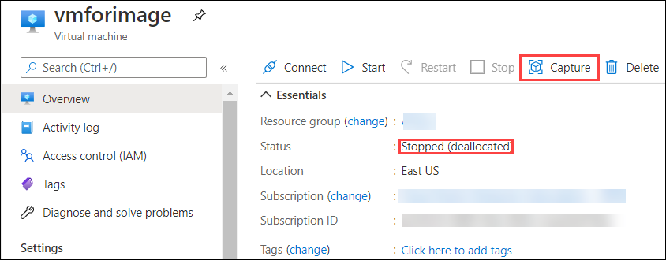

7. Enter the name of the virtual machine i.e **wvdwin10** and leave other values to default. Then click on **Create**.

   - Name: *Leave to default*
   - Resource group: *Select* **WVD-RG** *from the drop down.*
   - Type the virtual machine name: **wvdwin10**
   
   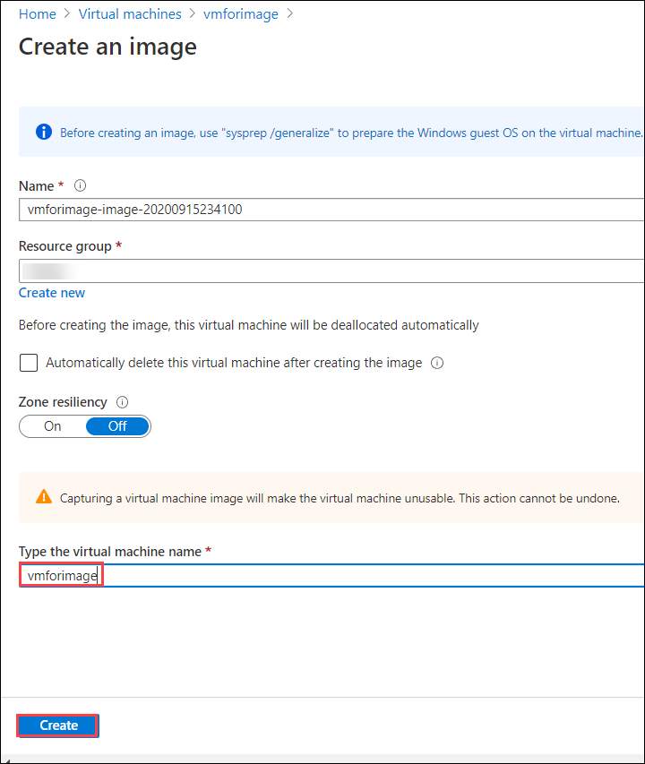

## **Task 6: Provision a Host Pool with a custom image**

1. In azure portal Search for *Windows Virtual Desktop* and select **Windows Virtual Desktop** from suggestions.

   

2. Open **Host pools** present under *Manage* blade, and then click on **+ Add**.

   

3. On the **Basics** tab configure your Host pool with following configurations:

   - Subscription: *Choose the default subscription*.
   - Resource Group: *Select **WVD-RG** from the drop down*.
   - Host pool name: **wvd-hostpool**
   - location: **EastUS**, *basically this should be same as the region of your resource group.*
   - Validation Environment: **No**
   - Host pool type: **Personal**
   - Assignment type: **Automatic**
   - Click on **Next: Virtual Machines**

   

4. In the *Virtual machine*s tab, select **Yes** against **Add virtual machines**. By doing this, we are stepping towards adding Virtual machines to the host pool.

   

5. In this step, we will provide the details of the VMs to be created as session Hosts. For your convenience, this step is divided into three sections as follows:

  **A.** Session Host Specifications:

   - Resource Group: *Select* **WVD-RG** *from the drop down.*
   - Virtual machine location: **East US**, *location should be same as location of your resource group.*
   - Virtual machine size: **Standard D1_v2**. *Click on **Change Size**, then select **D1_v2** and click on **Select** as shown below.*

   

   - Number of VMs: **2**
   - Name prefix: **VmFromImage**
   - Image type: **Gallery**
   - Image: *Click on **Browse all images and disks**, click on **My items** and select the Image we created earlier in this exercise, as shown below.*

   

   - OS disk type: **Standard SSD**
   - Use managed disks: **Leave to default**

   

  **B**. Network and Security:

  Leave all values to default, except:

   - Subnet: **sessionhosts-subnet(10.0.1.0/24)** *(choose from dropdown)*
   - Specify Domain or Unit: **No**

   

  **C**. Administrator Account details:

   - AD domain join UPN: *Paste your username* **<inject key="AzureAdUserEmail" />**
   - Password: *Paste the password* **<inject key="AzureAdUserPassword" />**
   - Confirm Password: *Paste the password* **<inject key="AzureAdUserPassword" />** again.
   - Click on **Next: Workspace**.

   

6.  In the *Workspace* section, we need to specify if we need to register the default application group to a workspace.

   - Register desktop app group: *Choose* **Yes**
   - To this workspace: *Click on* **Create new**

   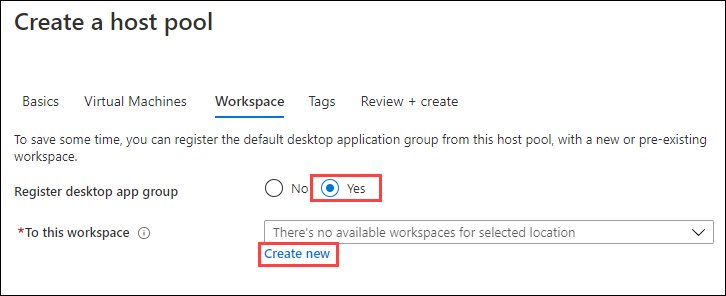

7. Under the *Workspace name*, fill the name of workspace.

   - Workspace name: **WVD-WS-02**
   - Click on **OK**

   

8. Now click on **Review + create** on the bottom left corner.

    

9. The last window helps us to verify if the parameters we filled are correct. Wait for validation to pass, then click on **Create** to initiate the deployment.

    

## **Task 7: Assign an Azure AD group to an application group**

1. In search bar of Azure portal, search for *Windows virtual desktop* and select **Windows virtual desktop** from the suggestions.

   

2. Under *Manage* blade, select **Application groups**. Then click on the *Default Application group* that was created while creating Host pool in previous task.

   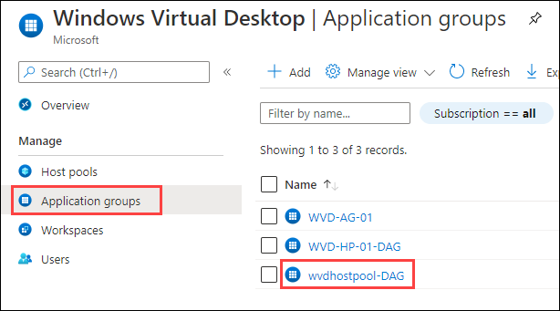

3. Now click on **Assignments** under Manage blade, and then click on **+ Add** button.

   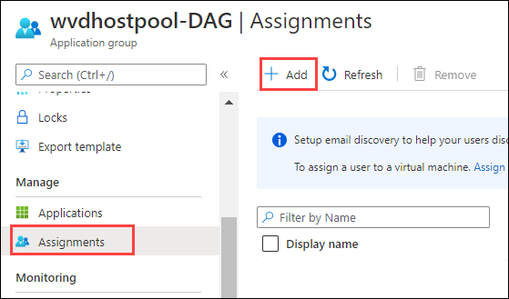

4. In the search bar, paste **<inject key="AzureAdUserEmail" />** and choose your user by clicking on it. At last, click on **Select** to save your changes.

   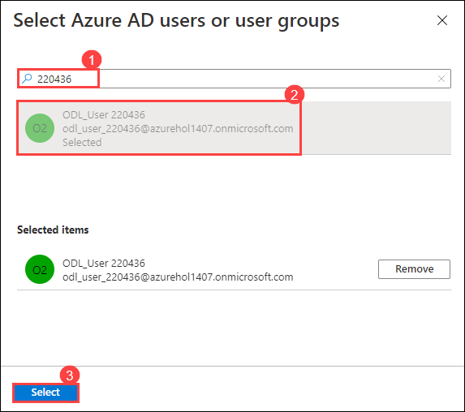

## **Task 8: Connect to WVD with the web client**

1. In your web browser, navigate to the URL below. 

   `https://rdweb.wvd.microsoft.com/arm/webclient`

> **Note:** If you are asked to login, use the following credentials:
> - Username: **<inject key="AzureAdUserEmail" />**
> - Password: **<inject key="AzureAdUserPassword" />**

2. The WVD dashboard will launch, then click on the tile named **Default Desktop** under workspace **WVD-WS-02** to launch the desktop.

   

3. Select **Allow** on the prompt asking permission to *Access local resources*.

   

4. Enter the lab credentials given below, to access the application and click on **Submit**.

   - Username: **<inject key="AzureAdUserEmail" />**
   - Password: **<inject key="AzureAdUserPassword" />**

   

5. The virtual desktop will launch and look similar to the screenshot below.

   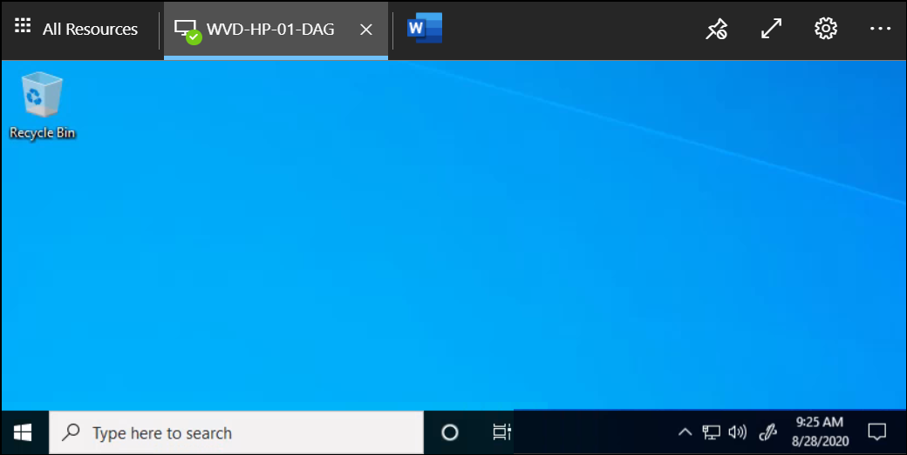

6. At last, validate the components relative to the configuration we made in previous task. The desktop should show icons for ***Microsoft Edge*** and ***Microsoft Teams***. When you go to the ***Windows start menu***, you can find the ***Office applications***.

   

7. Click on the **Next** button present in the bottom-right corner of this lab guide.

